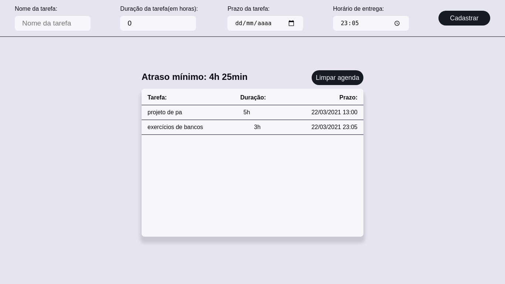
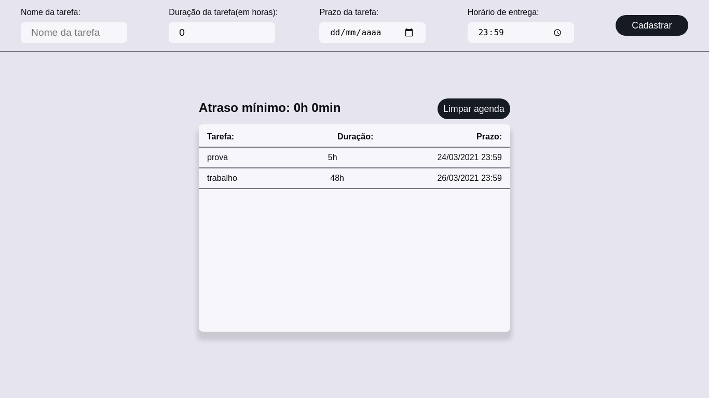

# Agenda Organizada

**Número da Lista**: 3 
**Conteúdo da Disciplina**: Algoritmos Greed 

## Alunos
|Matrícula | Aluno |
| -- | -- |
| 18/0016938  |  Gabriel Paiva Aguiar |
| 18/0025601 |  Murilo Gomes de Souza |

## Sobre 
Esse projeto é uma agenda pessoal que implementa o algoritmo **"Schedule to minimize lateness"**. Dessa forma, o usuário pode cadastrar diferentes tarefas, informando o prazo de entrega, e a agenda ordenará as tarefas e calculará o menor atraso para elas, de acordo com o algoritmo mostrado na disciplina. 

## Screenshots
  
  

## Instalação 
*Linguagem*: Typescript 
*Framework*: React 

### Pré-requisitos
Para utilizar o projeto, basta preencher os campos de cadastro de tarefa: nome, duração, data e horário do prazo.
A cada nova tarefa cadastrada, o algoritmo de mínimo atraso será rodado novamente, assim como cada vez que a agenda for aberta novamente (ou a aba do navegador for atualizada).

https://nodejs.org/en/

### Como rodar

1. Clone o projeto na sua máquina:

git clone https://github.com/projeto-de-algoritmos/Greed_AgendaOrganizada

2. Entre na pasta do projeto:

cd Greed_AgendaOrganizada/agendaorganizada

3. Instale as dependências do projeto:

npm install

4. Execute o projeto para subir o servidor:

npm start

5. Acesse o projeto no seu navegador através da url:

http://localhost:3000/

## Uso 
Para utilizar o projeto, basta preencher os campos de cadastro de tarefa: nome, duração, data e horário do prazo.
A cada nova tarefa cadastrada, o algoritmo de mínimo atraso será rodado novamente, assim como cada vez que a agenda for aberta novamente (ou a aba do navegador for atualizada).

## Outros 
Quaisquer outras informações sobre seu projeto podem ser descritas abaixo.

